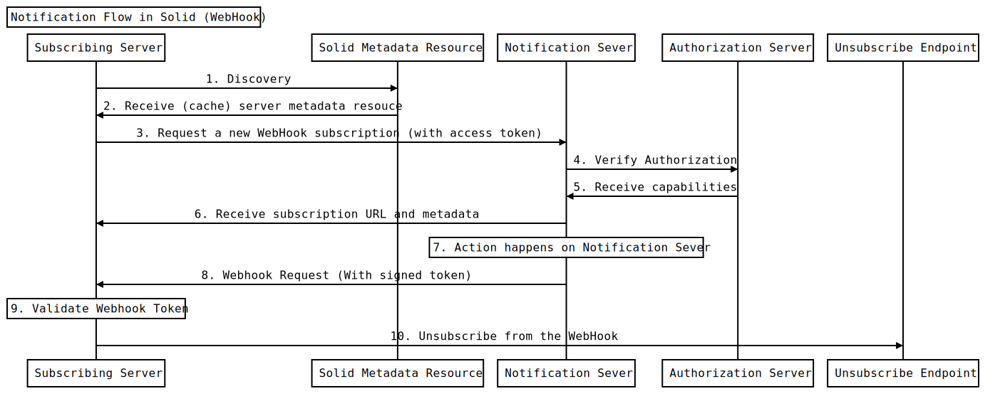

# WebHookSubscription2021

## Abstract
The [Solid Notification Protocol](https://solid.github.io/notifications/protocol) defines a set of interaction patterns for agents to establish subscriptions to resources in a Solid Storage.

This specification defines a subscription type that applies these patterns to WebHooks.

## Status of This Document

Version: 0.1

## 1. Introduction
_This section is non-normative._

The [Solid Notifications Protocol](https://solid.github.io/notifications/protocol) allows for many methods by which a client is notified of actions being performed on a resource. One such method of notification is webhooks. Webhooks allow servers to register a target URL with a Solid Storage. When that server needs to be notified of an action, that target URL will be called by the Solid Storage.

Webhooks are an alternative to websockets that are more useful for server-based use cases. While a websocket solution would require a server to maintain a constant websocket connection with a Pod as long as it wants notifications, webhooks only require one registration.

This document proposes an implementation for the `WebHookSubscription2021` Solid Notification protocol.

### 1.1. Specification Goals:

In addition to the goals set forth by the Solid Notifications Protocol, this specification has goals required by the WebHooks use case:

 1. **Verifiable requests to a subscribing server** - a subscribing server must be able to confirm if a request truly came from a specific Pod.
 2. **Unsubscribing from a WebHook** - Unlike websockets, where sockets can simply be closed by the client, if a subscribing server wants to unsubscribe from a webhook, it must alert a Pod.

### 1.2. Terminology

This document uses terms from the Solid Protocol specification, including "data pod". This document also uses terms from the OAuth2 specification, including "resource server", "authorization server", and "client", as well as terms from the WebSub specification, including "topic". Terms from the General Solid Notifications specification are also used, including “Notification Gateway API”, “Notification Subscription API”, and “Solid Server Metadata Resource.”

In addition, the following terms are defined:

**Subscribing Server** -- A server with some HTTP resource that will receive webhook requests from the Pod. For the case of the example, it can also be the server that initiates the subscription.

**Pod (Private/Public) Key** -- A private public keypair associated with a specific data Pod.

### 1.3. Conformance
All assertions, diagrams, examples, and notes are non-normative, as are all sections explicitly marked non-normative. Everything else is normative.

The key words “MUST” and “MUST NOT” are to be interpreted as described in [BCP 14](https://tools.ietf.org/html/bcp14) [RFC2119] [RFC8174] when, and only when, they appear in all capitals, as shown here.

## 2. General Overview
_This section is non-normative._

The following is an example flow for the solid webhook notification flow with the `webhook-auth` feature enabled. We follow an example subscribing server chat app called "Liqid Chat." It wants to subscribe to a resource at `https://bob.pod.example/chat1.ttl`.

### 2.1. Actors

 - **Authenticated User**: The user authenticated with the client server. In this case, our authenticated user is Bob, with the WebID `https://bob.pod.example/profile/card#me`.
 - **Subscribing Server**: A server interestest in a webhook alert. In this example it is "Liqid Chat," a chat app API hosted at `https://api.liqid.chat`.
 - **Solid Metadata Resouce**: A metadata resource compliant with the Solid Specification. In this example, it is hosted at `https://pod.example/.well-known/solid`.
 - **Subscription API**: an HTTP API at which a client can initiate a subscription to notification events for a particular set of resources. In this example, it is hosted at `https://pod.example/subscription`
 - **Authorization Server**: a Solid OIDC compliant identity server. In this example, it is hosted at `https://idp.example`
 - **Topic Resource**: A resource on a Pod that is being tracked for webhooks. In this example, it is hosted at `https://bob.pod.example/chat1.ttl`.
 - **Notification Server**: A server responsible for delivering a webhook notification. This may or may not be the same server as the resource server. In this example, the notification server is `https://pod.example/notifications/webhook/subscription`.
 - **Notification Server WebID**: A notification server has its own WebID known as the `Notification Server WebID`. In this example the Notification Server WebID is `https://pod.example/notifications/webhook/card.ttl#i`.

### 2.2. Flow Diagram



### 2.3. Steps

#### 1. Discovery

A request is sent from the subscribing server

```http
GET https://pod.example/.well-known/solid
```

#### 2. Receive (cache) server metadata resouce

The following metadata document is returned:

```http
Content-Type: text/turtle

@prefix solid: <http://www.w3.org/ns/solid/terms#> .
@prefix notify: <http://www.w3.org/ns/solid/notifications#> .

<>
  a solid:StorageMetadata ;
  notify:hasNotificationChannel <#webhookNotification> .

<#webhookNotification>
  a notify:WebHookSubscription2021 ;
  notify:subscription <https://pod.example/notifications/webhook/subscription> ;
  notify:webid <https://pod.example/notifications/webhook/card.ttl#i> ;
  notify:features notify:rate, notify:expiration, notify:webhookAuth .
```

Note the use of `nofify:subscription` and `notify:webid`. We'll be using those in future steps.

#### 3. Request a new WebHook subscription (with access token)

This non-normative example assumes that we are authenticating using Solid-OIDC. Other authentication

Assuming the subscribing server already went through one of the Solid OIDC authentication flows, an Auth Token a DPoP Proof can be provided to the subscription resource.

```http
POST https://pod.example/notifications/webhook/subscription
Authorization: DPoP <token>
DPoP: <proof>
Content-Type: application/ld+json

{
    "@context": ["https://www.w3.org/ns/solid/notification/v1"],
    "type": "WebHookSubscription2021",
    "topic": "https://bob.pod.example/chat1",
    "target": "https://api.liqid.chat/webhook",
    "state": "opaque-state",
    "expiration": "2021-09-21T12:37:15Z",
    "rate": "PT10s"
}
```

If a token is not provided Pod will return 401.

#### 4. Verify Authorization

The Pod makes a request to the auth server to retrieve the Auth server's JWKS.

```http
GET https://idp.example/.well-known/openid-configuration
GET https://idp.example/jwks
```

#### 5. Receive capabilities

The auth server returns the JWKS.

If the token is not valid or the user does not have READ access to the resource, the Pod will return 403 to the server client.

#### 6. Receive subscription URL and metadata
The Pod returns a subscription URL to the subscribing server.

```http
Content-Type: application/ld+json

{
    "@context": "https://www.w3.org/ns/solid/notification/v1",
    "type": "WebHookSubscription2021",
    "target": "https://api.liqid.chat/webhook",
    "unsubscribe_endpoint": "https://pod.example/notifications/webhook/subscription/a59e24ba-8231-4b51-b60a-c0e04740f617"
}
```

Note the "unsubscribe_endpoint." We'll use that later when we unsubscribe from this hook.

At this point, the webhook has been successfully registered.

#### 7. Action happens on Topic Resource
Some action (either an update to the resource or a deletion of that resource) has taken place on the topic resource.

#### 8. Webhook Request (With token signed by the Pod Key)
A request is made to the subscribing server's registered webhook.

```http
POST https://api.liqid.chat/webhook
Authorization: DPoP <authToken>
Dpop: <dpopProof>
Content-Type: application/ld+json

{
   "@context":[
      "https://www.w3.org/ns/activitystreams",
      "https://www.w3.org/ns/solid/notification/v1"
   ],
   "id":"urn:uuid:<uuid>",
   "type":[
     "Update"
   ],
   "actor":[
      "https://bob.pod.example/profile/card#me"
   ],
   "object":{
   },
   "state": "1234-5678-90ab-cdef-12345678",
   "published":"2021-08-05T01:01:49.550044Z"
   "unsubscribe_endpoint": "https://pod.example/webhooks/subscription/a59e24ba-8231-4b51-b60a-c0e04740f617"
}
```

The value of `<authToken>` is a DPoP bound JSON Web Token representing `https://pod.example/webhooks/card.ttl#i`. Both tokens correspond to the authentication method outlined in Solid OIDC.


`<dpopProof>` is a dpop proof containing the claims `{ htu: "https://api.liqid.chat/webhook", htm: "POST" }`. Both tokens correspond to the authentication method outlined in Solid OIDC.

The subscribing server should check the `iss` field and confirm that it matches the URL used in the discovery stage.

#### 9. Validate Webhook Token
The client validates the tokens it received in the request headers as defined in the Solid OIDC specification

#### 16. Unsubscribe from the webhook
If the client wishes to unsubscribe from the webhook, it can make a DELETE request to the provided `unsubscribe_endpoint`.

```http
DELETE https://pod.example/notifications/webhook/subscription/a59e24ba-8231-4b51-b60a-c0e04740f617
```

## 3. Subscription API
The request body of the notification server's subscription url `MUST` have the `type` field set to `"WebHookSubscription2021"`. If it is not, the server `MUST` either use a different corresponding potocol or reject the request.

The request body of the notification server's subscription url `MUST` include a `target` field, the value of which `MUST` be a URI with an `https` scheme. If it is not, the server `MUST` reject the request.

If a request is received at the notification server's subscription url and it is not authenticated in some way, the Pod `MUST` reject the request.

The authenticated user during the subscribe request must have READ access to the topic resource. If it does not, the server `MUST` reject.

The response body of the notification server's subscription url `MUST` include the `target` field, the value of which corresponds to the provided `target` field.

The response body of the notification server's subscription url `MUST` include the `unsubscribe_endpoint` field. The value is a URI that will close the subscription (See Unsubscribe API)

## 4. Webhook API

When a subscribed resource is updated or removed, the notification server `MUST` send a request to the registered target URI (the webhook request).

The body of the webhook request `MUST` include a `unsubscribe_endpoint` field that corresponds with a URI that will close the subscription (See Unsubscribe API)

### 4.1. Notification Types

All servers implementing the `WebHookSubscription2021` protocol `MUST` implement the following Notifications Types.

#### 4.1.1. Update

If a resource is updated (triples are added or removed from a Linked Data Resource or any bytes are changed in binary), the Pod `MUST` send a webhook request to all subscribed targets.

The webhook request `MUST` follow the standard outlined in the [Acivity Pub Update Type](https://www.w3.org/TR/activitystreams-vocabulary/#dfn-update)

#### 4.1.2 Delete

If a resource is deleted, the Pod `MUST` send a webhook request to all subscribed targets.

The webhook request `MUST` follow the standard outlined in the [Acivity Pub Delete Type](https://www.w3.org/TR/activitystreams-vocabulary/#dfn-delete)

## 5. Unsubscribe API

All servers implementing the `WebHookSubscription2021` protocol `MUST` provide a unique resource for each subscription. This will be called the "Unsubscribe Endpoint."

If a `DELETE` request is received at the unsubscribe endpoint, the Pod `MUST` forget that subscription and any subsequent actions should not trigger a webhook request.

If a request is received at the unsubscribe endpoint and it does not include an Authorization or DPoP header, the Authorization or DPoP Headers are invalid, or the WebID in the authorization header does not correspond with the WebID that made the subscription, the Pod `MUST` reject the request.

## 6. Features
This section details the additional features built for `WebHookSubscription2021`.

### 6.1 webhook-auth
The `webhook-auth` feature allows subscribing servers to verify that a request came from a certain Pod.

Pods that implement the `webhook-auth` feature `MUST` create an Access Token and DPoP proof in accordance with the Solid OIDC specification and include those tokens in the headers of all webhook requests.

## Further Considerations
 - Using DPoP authentication in the webhook request does coincide with the common use case for Solid-OIDC, but it is overkill. There is no need for a security model that has two separate tokens (DPoP Token and the Auth token). Instead, we should consider using one token with the combined features (identity + htm and htu) of the two tokens.
 - The fact that the Pod allows any URI to be submitted as a `target` might lead to distributed denial of service attacks originating from Pods. A malicious actor could create an app and trick many users to join it. The malicious app would then create a webhook targeting its desired target. It may be a good idea to build in an automated verification process to confirm that the entity sending the subscription request also owns the target webhook endpoint.
 - The examples in this specification assume that the base domain `https://bob.pod.example` are interchangable with `https://pod.example`. This is not always the case and could lead to security vulnerabilities.
 - Defining a feature that includes the resource or the delta of the changes in the request are beyond the scope of this document, but it's something that should be considered.
 - What is the UUID in the webhook body?
 
