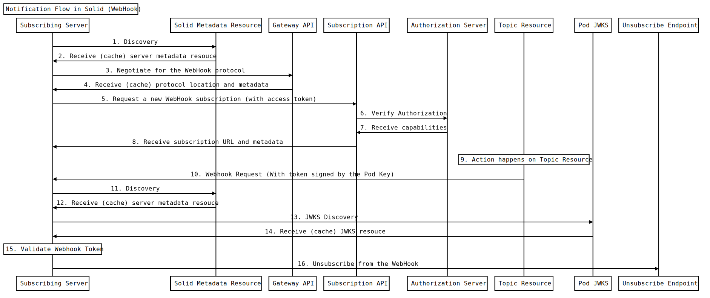

# Solid Webhook Notifications

Status: Proposal

## Introduction

The Solid Notifications Specification allows for many methods by which a client is notified of actions being performed on a resource. One such method of notification is webhooks. Webhooks allow servers to register an endpoint with a Solid Pod. When that server needs to be notified of an action, that endpoint will be called by the Solid Pod.

Webhooks are an alternative to websockets that are more useful for server-based use cases. While a websocket solution would require a server to maintain a constant websocket connection with a Pod as long as it wants notifications, webhooks only require one registration.

This document proposes an implementation for the `WebHookSubscription2021` Solid Notification protocol.

## Use Cases

 1. All use cases from the [general notifications API](solid-notifications.md#Use%20Cases) are still applicable.
 2. **Verifiable requests to a subscribing server** - a subscribing server must be able to confirm if a request truly came from a specific Pod.
 3. **Unsubscribing from a WebHook** - Unlike websockets, where sockets can simply be closed by the client, if a subscribing server wants to unsubscribe from a webhook, it must alert a Pod.

## Terminology

This document uses terms from the Solid Protocol specification, including "data pod". This document also uses terms from the OAuth2 specification, including "resource server", "authorization server", and "client", as well as terms from the WebSub specification, including "topic". Terms from the General Solid Notifications specification are also used, including “Notification Gateway API”, “Notification Subscription API”, and “Solid Server Metadata Resource.”

In addition, the following terms are defined:

**Subscribing Server** -- A server with some HTTP endpoint that will receive webhook requests from the Pod. For the case of the example, it can also be the server that initiates the subscription.

**Pod (Private/Public) Key** -- A private public keypair associated with a specific data Pod.

## High-level Flow

This section is non-normative.

The following is an example flow for the solid webhook notification flow with the `webhook-auth` feature enabled. We follow an example subscribing server chat app called "Liqid Chat." It wants to subscribe to a resource at `https://bob.pod.example/chat1.ttl`.

### Actors

 - **Authenticated User**: The user authenticated with the client server. In this case, our authenticated user is Bob, with the WebId `https://bob.pod.example/profile/card#me`.
 - **Subscribing Server**: A server interestest in a webhook alert. In this example it is "Liqid Chat," a chat app API hosted at `https://api.liqid.chat`.
 - **Solid Metadata Resouce**: A metadata resource compliant with the Solid Specification. In this example, it is hosted at `https://pod.example/.well-known/solid`.
 - **Gateway API**: An HTTP endpoint at which a client can negotiate an acceptable notification subscription location. In this example, it is hosted at `https://pod.example/gateway`.
 - **Subscription API**: an HTTP endpoint at which a client can initiate a subscription to notification events for a particular set of resources. In this example, it is hosted at `https://pod.example/subscription`
 - **Authorization Server**: a Solid OIDC compliant identity server. In this example, it is hosted at `https://idp.example`
 - **Topic Resource**: A resource on a Pod that is being tracked for webhooks. In this example, it is hosted at `https://bob.pod.example/chat1.ttl`.
 - **Pod JWKS**: An endpoint that delivers a JSON Web Key Set for the `webhook-auth` feature. In this example, it's hosted at `https://pod.example/jwks`.

### Flow Diagram



### Steps

#### 1. Discovery

A request is sent from the subscribing server

```http
GET https://pod.example/.well-known/solid
```

#### 2. Receive (cache) server metadata resouce

The following metadata document is returned:

```http
Content-Type: application/ld+json

{
    "@context": ["https://www.w3.org/ns/solid/notification/v1"],
    "notification_endpoint": "https://pod.example/gateway",
    "jwks_endpoint": "https://pod.example/jwks"
    ...
}
```

**NOTE:** the extra field called `jwks_endpoint`. This will be required later for the `webhook-auth` feature.

#### 3. Negotiate for the WebHook protocol

The subscribing server makes a request to the `notification_endpoint` provided in the metadata resource. It includes `WebHookSubscription2021` as the desired type and `state`, `rate`, and `webhook-auth` as the desired features.

```http
POST https://pod.example/gateway
Content-Type: application/ld+json

{
    "@context": ["https://www.w3.org/ns/solid/notification/v1"],
    "type": ["WebHookSubscription2021"],
    "features": ["state", "rate", "webhook-auth"]
}
```

#### 4. Receive (cache) protocol location and metadata

Protocol metadata is returned if the server supports the requested data. If the server does not support the requested data **WHAT HAPPENS? I DON'T KNOW.**

```http
Content-Type: application/ld+json

{
    "@context": ["https://www.w3.org/ns/solid/notification/v1"],
    "type": "WebHookSubscription2021",
    "endpoint": "https://pod.example/subscription",
    "features": ["state", "rate", "expiration", "webhook-auth"]
}
```

#### 5. Request a new WebHook subscription (with access token)

This non-normative example assumes that we are authenticating using Solid-OIDC. Other authentication

Assuming the subscribing server already went through one of the Solid OIDC authentication flows, an Auth Token a DPoP Proof can be provided to the subscription endpoint.

```http
POST https://pod.example/subscription
Authorization: DPoP <token>
DPoP: <proof>
Content-Type: application/ld+json

{
    "@context": ["https://www.w3.org/ns/solid/notification/v1"],
    "type": "WebHookSubscription2021",
    "topic": "https://bob.pod.example/chat1",
    "target": "https://api.liqid.chat/webhook",
    "state": "opaque-state",
    "expiration": "2021-09-21T12:37:15Z",
    "rate": "PT10s"
}
```

If a token is not provided Pod will return 401.

#### 6. Verify Authorization

The Pod makes a request to the auth server to retrieve the Auth server's JWKS.

```http
GET https://idp.example/.well-known/openid-configuration
GET https://idp.example/jwks
```

#### 7. Receive capabilities

The auth server returns the JWKS.

If the token is not valid or the user does not have READ access to the resource, the Pod will return 403 to the server client.

#### 8. Receive subscription URL and metadata
The Pod returns a subscription URL to the subscribing server.

```http
Content-Type: application/ld+json

{
    "@context": "https://www.w3.org/ns/solid/notification/v1",
    "type": "WebHookSubscription2021",
    "target": "https://api.liqid.chat/webhook",
    "unsubscribe_endpoint": "https://pod.example/webhooks/a59e24ba-8231-4b51-b60a-c0e04740f617"
}
```

Note the "unsubscribe_endpoint." We'll use that later when we unsubscribe from this hook.

At this point, the webhook has been successfully registered.

#### 9. Action happens on Topic Resource
Some action (either an update to the resource or a deletion of that resource) has taken place on the topic resource.


#### 10. Webhook Request (With token signed by the Pod Key)
A request is made to the subscribing server's registered webhook.

```http
POST https://api.liqid.chat/webhook
Authorization: <token>
Content-Type: application/ld+json

{
   "@context":[
      "https://www.w3.org/ns/activitystreams",
      "https://www.w3.org/ns/solid/notification/v1"
   ],
   "id":"urn:uuid:<uuid>",
   "type":[
     "Update"
   ],
   "actor":[
      "https://bob.pod.example/profile/card#me"
   ],
   "object":{
   },
   "state": "1234-5678-90ab-cdef-12345678",
   "published":"2021-08-05T01:01:49.550044Z"
   "unsubscribe_endpoint": "https://pod.example/webhooks/a59e24ba-8231-4b51-b60a-c0e04740f617"
}
```

The value of `<token>` is a JSON Web Token signed by the Pod's Key. The unencoded token is below:

```javascript
JWTSign({
  htu: "https://api.liqid.chat/webhook",
  htm: "POST",
  iss: "https://pod.example"
  iat: 1516239022
  exp: 1515239482
}, POD_PRIVATE_KEY)
```

The subscribing server should check the `iss` field and confirm that it matches the URL used in the discovery stage.

#### 11. Discovery

If not already cached, the subscribing server should retrieve the Pod, metadata document.

```http
GET https://pod.example/.well-known/solid
```

#### 12. Receive (cache) server metadata resouce

The metadata document will be returned.

```http
Content-Type: application/ld+json

{
    "@context": ["https://www.w3.org/ns/solid/notification/v1"],
    "notification_endpoint": "https://pod.example/gateway",
    "jwks_endpoint": "https://pod.example/jwks"
    ...
}
```

#### 13. JWKS Discovery
The `jwks_endpoint` can be used to get the Pod's JSON Web Key Store

```http
GET https://pod.example/jwks
```

#### 14. Receive (cache) JWKS resouce
The Pod returns its JWKS

```http
Content-Type: application/json

{"keys":[...]}
```

#### 15. Validate Webhook Token
Using the JWKS the subscribing server should validate the token provided in the authorization header. If the token is invalid, the subscribing server should reject the request.

#### 16. Unsubscribe from the webhook
If the client wishes to unsubscribe from the webhook, it can make a DELETE request to the provided `unsubscribe_endpoint`.

```http
DELETE https://pod.example/webhooks/a59e24ba-8231-4b51-b60a-c0e04740f617
```

## Subscription API
The request body of the subscription API `MUST` have the `type` field set to `"WebHookSubscription2021"`. If it is not, the server `MUST` either use a different corresponding potocol or reject the request.

The request body of the subscription API `MUST` include a `target` field, the value of which `MUST` be a URI with an `https` scheme. If it is not, the server `MUST` reject the request.

If a request is received at the subscribe endpoint and it is not authenticated in some way, the Pod `MUST` reject the request.

The authenticated user during the subscribe request must have READ access to the topic resource. If it does not, the server `MUST` reject.

The response body of the subscription API `MUST` include the `target` field, the value of which corresponds to the provided `target` field.

The response body of the subscription API `MUST` include the `unsubscribe_endpoint` field. The value is a URI that will close the subscription (See Unsubscribe API)

## Webhook API

When a subscribed resource is updated or removed, the Pod `MUST` send a request to the registered target URI (the webhook request).

The body of the webhook request `MUST` include a `unsubscribe_endpoint` field that corresponds with a URI that will close the subscription (See Unsubscribe API)

### Notification Types

All servers implementing the `WebHookSubscription2021` protocol `MUST` implement the following Notifications Types.

#### Update

If a resource is updated (triples are added or removed from a Linked Data Resource or any bytes are changed in binary), the Pod `MUST` send a webhook request to all subscribed targets.

The webhook request `MUST` follow the standard outlined in the [Acivity Pub Update Type](https://www.w3.org/TR/activitystreams-vocabulary/#dfn-update)

#### Delete

If a resource is deleted, the Pod `MUST` send a webhook request to all subscribed targets.

The webhook request `MUST` follow the standard outlined in the [Acivity Pub Delete Type](https://www.w3.org/TR/activitystreams-vocabulary/#dfn-delete)

## Unsubscribe API

All servers implementing the `WebHookSubscription2021` protocol `MUST` provide a unique endpoint for each subscription. This will be called the "Unsubscribe Endpoint."

If a `DELETE` request is received at the unsubcribe endpoint, the Pod `MUST` forget that subscription and any subsequent actions should not trigger a webhook request.

If a request is received at the unsubscribe endpoint and it does not include an Authorization or DPoP header, the Authorization or DPoP Headers are invalid, or the WebId in the authorization header does not correspond with the WebId that made the subscription, the Pod `MUST` reject the request.

## Features

This section details the additional features built for `WebHookSubscription2021`.

### webhook-auth
The `webhook-auth` feature allows subscribing servers to verify that a request came from a certain Pod.

Pods that implement the `webhook-auth` feature `MUST` include an HTTP endpoint that produces a JSON Web Key Set.

Pods that implement the `webhook-auth` feature `SHOULD` rotate keys on its JSON Web Key Set.

Pods that implement the `webhook-auth` feature `MUST` include the `jwks_endpoint` field in the Solid Metadata document. The value of this field is the Pods JWKS endpoint.

When a webhook is triggered, compliant Pods `MUST` include an `authorization` header with a token signed by a key in its JSON Web Key Set. The token `MUST` include the following fields:
 - exp: A number indicating the expiration of the token
 - htu: The url of the webhook target
 - htm: The method of the webhook request. Because all webhook request use the `POST` method, this value will always be `POST`.

## Further Considerations
 - The fact that the Pod allows any URI to be submitted as a `target` might lead to distributed denial of service attacks originating from Pods. A malicious actor could create an app and trick many users to join it. The malicious app would then create a webhook targeting its desired target. It may be a good idea to build in an automated verification process to confirm that the entity sending the subscription request also owns the target webhook endpoint.
 - The examples in this specification assume that the base domain `https://bob.pod.example` are interchangable with `https://pod.example`. This is not always the case and could lead to security vulnerabilities.
 - Defining a feature that includes the resource or the delta of the changes in the request are beyond the scope of this document, but it's something that should be considered.
 - What is the UUID in the webhook body?
